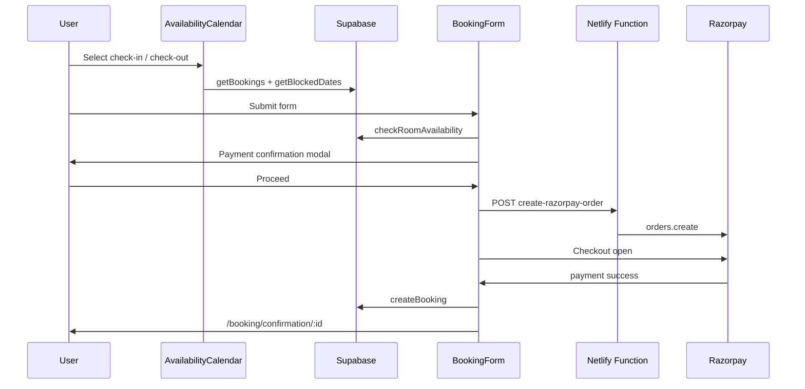

# Feature Recreation Guide — Brick & Beam

This document explains how to recreate four core features from this project: **user availability calendar**, **admin calendar**, **Razorpay payments**, and **Supabase backend**. Use it when building a new app or porting these features elsewhere.

---

## Tech stack (summary)

| Layer | Technology |
|--------|------------|
| Frontend | React 18, TypeScript, Vite |
| UI calendar | FullCalendar (`@fullcalendar/react`, `daygrid`, `interaction`) |
| Backend / DB | Supabase (PostgreSQL + JS client) |
| Serverless API | Netlify Functions |
| Payments | Razorpay Checkout + Orders API |
| Routing | React Router v6 |
| Toasts | react-hot-toast |

---

## Environment variables

### Frontend (`.env` — Vite prefix `VITE_`)

```env
VITE_SUPABASE_URL=https://xxxx.supabase.co
VITE_SUPABASE_ANON_KEY=eyJhbG...
VITE_RAZORPAY_KEY_ID=rzp_test_xxxx   # Public key only — safe in browser
VITE_SLUG_SECRET=optional-for-slugs
```

### Netlify Functions (`netlify/functions/.env` or Netlify dashboard)

```env
RAZORPAY_KEY_ID=rzp_test_xxxx
RAZORPAY_KEY_SECRET=xxxx              # Secret — never expose to frontend
SUPABASE_URL=https://xxxx.supabase.co
SUPABASE_ANON_KEY=eyJhbG...
SUPABASE_SERVICE_ROLE_KEY=eyJhbG...   # For admin/server tasks if needed
```

### Local dev

```bash
npm run dev          # netlify dev — serves Vite + functions on one port (e.g. 8888)
npm run dev:vite     # Vite only — Razorpay order API won't work without Netlify
```

---

# 1. User availability calendar

## Purpose

Guests pick **check-in** and **check-out** on a month grid. Booked and blocked dates are disabled; past dates are disabled.

## Key files

| File | Role |
|------|------|
| `src/components/AvailabilityCalendar.tsx` | Full calendar UI + date logic |
| `src/pages/BookingForm.tsx` | Embeds calendar, calls `onDateSelect` |
| `src/pages/RoomDetail.tsx` | Same calendar on room/villa detail |
| `src/lib/supabase.ts` | `api.getBookings()`, `api.getBlockedDates()`, `api.checkRoomAvailability()` |

## NPM packages

```json
"@fullcalendar/react": "^6.1.18",
"@fullcalendar/daygrid": "^6.1.18",
"@fullcalendar/interaction": "^6.1.18"
```

## Component API

```tsx
<AvailabilityCalendar
  roomId={room.id}
  onDateSelect={(startDate, endDate) => { /* ISO date strings YYYY-MM-DD */ }}
  selectedStartDate={checkIn}
  selectedEndDate={checkOut}
/>
```

## Data loading (on mount / `roomId` change)

Parallel fetch:

1. `api.getBookings()` — filter `room_id === roomId`, website source only
2. `api.getBlockedDates(roomId)` — filter `source === 'manual'`
3. `api.getRooms()` — room name / quantity for display

## FullCalendar events

| Type | Color / style | Source |
|------|----------------|--------|
| Booking | Light red background | `bookings` rows |
| Blocked | Light gray | `blocked_dates` rows |
| User selection | Highlight (custom) | Parent state |

Event shape:

```ts
{
  id: string,
  title: '–',
  start: 'YYYY-MM-DD',      // check_in_date or blocked start
  end: 'YYYY-MM-DD',        // check_out_date (exclusive in FC for ranges)
  allDay: true,
  extendedProps: { type: 'booking' | 'blocked', booking?, blockedDate? }
}
```

## Date selection rules

1. **Past dates** — click ignored
2. **Blocked / booked** — `isDateBlocked(dateStr)` returns true → no click
3. **First click** — sets check-in, clears check-out
4. **Second click** — if after check-in → sets check-out; if same day → error (handled in parent)
5. **Drag range** — `handleDateRangeSelect` validates no overlap with bookings/blocks

## Availability check (before payment)

`api.checkRoomAvailability(roomId, checkIn, checkOut)`:

- Rejects `checkIn === checkOut`
- Loads `bookings` with `booking_status IN ('confirmed', 'pending')`
- Loads `blocked_dates` for `room_id`
- **Overlap logic** (any night in range conflicts):

```ts
(bookingStart <= checkIn && bookingEnd > checkIn) ||
(bookingStart < checkOut && bookingEnd >= checkOut) ||
(bookingStart >= checkIn && bookingEnd <= checkOut) ||
(checkIn >= bookingStart && checkOut <= bookingEnd)
```

Returns `{ available: boolean, reason?, conflicts? }`.

## Minimal recreation steps

1. Install FullCalendar packages
2. Create `AvailabilityCalendar` with `roomId` + `onDateSelect`
3. Map Supabase bookings/blocks → FC events
4. Implement click + range select with overlap checks
5. Call `checkRoomAvailability` in booking form before opening payment modal

---

# 2. Admin calendar

## Purpose

Staff see **all bookings** and **manual blocked dates** on one calendar. Click events for details; drag-select dates to **block** or **unblock**.

## Key files

| File | Role |
|------|------|
| `src/pages/AdminCalendar.tsx` | Page: load data, block/unblock modals |
| `src/components/EnhancedCalendar.tsx` | FullCalendar + event click modals |
| `src/components/BookingDetailsModal.tsx` | Booking detail popup |
| `src/components/BlockedDateDetailsModal.tsx` | Blocked date popup |
| `src/App.tsx` | Route: `/admin/calendar` → `AdminCalendar` |

## NPM packages

Same FullCalendar stack as user calendar.

## Data loading

```ts
const [bookings, rooms, blockedDates] = await Promise.all([
  api.getBookings(),
  api.getRooms(),
  api.getBlockedDates(),  // all rooms, optional filter by selectedRoom
])
```

Pass into:

```tsx
<EnhancedCalendar
  bookings={bookings}
  rooms={rooms}
  blockedDates={blockedDates}
  selectedRoom={selectedRoom}  // number | 'all'
  onDateSelect={handleDateSelect}
  refreshTrigger={refreshTrigger}
  onRefreshData={() => setRefreshTrigger(n => n + 1)}
/>
```

## Event colors (admin)

| Status | Background |
|--------|------------|
| Confirmed booking | Red `#ef4444` |
| Pending | Amber `#f59e0b` |
| Cancelled | Gray `#6b7280` |
| Manual block | Blue `#3b82f6` |

Titles include guest name + room name.

## Block dates flow

1. Admin selects date range on calendar → `handleDateSelect(selectInfo)`
2. If range matches existing manual block → **unblock** modal
3. Else → **block** modal with `room_id`, `start_date`, `end_date`, `reason`, `notes`
4. Save: `api.blockDates({ room_id, start_date, end_date, reason, notes, source: 'manual' })`
5. Unblock: `api.deleteBlockedDate(id)`

## Blocked dates table (Supabase)

```sql
CREATE TABLE blocked_dates (
  id SERIAL PRIMARY KEY,
  room_id INTEGER NOT NULL REFERENCES rooms(id),
  start_date DATE NOT NULL,
  end_date DATE NOT NULL,
  reason VARCHAR(255) NOT NULL,
  notes TEXT,
  source VARCHAR(50) DEFAULT 'manual',
  created_at TIMESTAMPTZ DEFAULT NOW()
);
```

## Optional: iCal feed

- Function: `netlify/functions/calendar-feed.js`
- Redirect: `/calendar/feed.ics` → function (see `netlify.toml`)
- Page: `src/pages/AdminCalendarFeed.tsx`

## Minimal recreation steps

1. Admin route + protected layout
2. `EnhancedCalendar` with booking/block event converters
3. `select` interaction → block modal → `blockDates` / `deleteBlockedDate`
4. `eventClick` → booking or blocked detail modals
5. Room filter dropdown (`selectedRoom`)

---

# 3. Razorpay

## Purpose

Create order **server-side**, open Razorpay Checkout **client-side**, on success **insert booking** in Supabase.

## Architecture

```
[Browser]  handleSubmit → PaymentConfirmationModal → processPayment
    ↓
POST /.netlify/functions/create-razorpay-order  { amount, currency, receipt, notes }
    ↓
[Razorpay API] orders.create({ amount: amount * 100 })  // paise
    ↓
[Browser] new Razorpay({ key, order_id, handler }).open()
    ↓
handler → handlePaymentSuccess → api.createBooking(...)
    ↓
navigate(/booking/confirmation/:id)
```

## Key files

| File | Role |
|------|------|
| `src/lib/razorpay.ts` | `loadRazorpayScript()`, helper types |
| `netlify/functions/create-razorpay-order.js` | Creates order with secret key |
| `src/pages/BookingForm.tsx` | `processPayment`, `handlePaymentSuccess` |
| `src/components/PaymentConfirmationModal.tsx` | Review before pay |
| `src/components/PaymentCancellationModal.tsx` | Cancel / retry UI |

## Server function (`create-razorpay-order.js`)

**Input (JSON body):**

```json
{
  "amount": 29120,
  "currency": "INR",
  "receipt": "booking_123",
  "notes": { "guest_name": "...", "room_name": "..." }
}
```

**Validation:** `amount` number &gt; 0, max 1,000,000; `receipt` string ≤ 100 chars.

**Razorpay:** `amount: Math.round(amount * 100)` — function expects **rupees**, converts to **paise**.

**Output:**

```json
{ "success": true, "order": { "id": "order_xxx", ... } }
```

## Client checkout options

```ts
const options = {
  key: import.meta.env.VITE_RAZORPAY_KEY_ID,
  amount: totalAmount,           // Razorpay also accepts amount in paise in some setups; this project passes rupees in options — verify against your SDK version
  currency: 'INR',
  name: displayName,
  description: `Booking for ${displayName}`,
  order_id: orderData.order.id,
  handler: (response) => handlePaymentSuccess(response, orderData),
  prefill: { name, email, contact: phone },
  theme: { color: '#10B981' },
  modal: { ondismiss: () => { /* cancel flow */ } },
}
const razorpay = new window.Razorpay(options)
razorpay.on('payment.failed', ...)
razorpay.open()
```

## Booking record after payment

```ts
await api.createBooking({
  room_id,
  room_name: displayName,
  check_in_date,
  check_out_date,
  num_guests,
  num_extra_adults: numAdults,
  num_children_above_5: numChildren,
  first_name, last_name, email, phone,
  special_requests,
  total_amount,
  subtotal_amount,
  booking_status: 'confirmed',
  payment_status: 'paid',
  payment_gateway: 'razorpay',
  razorpay_order_id: orderData.order.id,
  razorpay_payment_id: response.razorpay_payment_id,
})
```

## Localhost bypass

If hostname is `localhost` or `127.0.0.1`, `processPayment` skips Razorpay and calls `handlePaymentSuccess` with mock IDs (for dev testing).

## Razorpay dashboard setup

1. Create account at [razorpay.com](https://razorpay.com)
2. **Test mode:** use `rzp_test_` keys
3. Add **Key ID** to `VITE_RAZORPAY_KEY_ID`
4. Add **Key ID + Secret** to Netlify env for the function
5. Enable payment methods you need in dashboard

## Security notes

- **Never** put `RAZORPAY_KEY_SECRET` in frontend env
- Recommended: verify `razorpay_signature` on server before confirming booking (this project stores payment without server-side signature verification in the snippet reviewed — add for production hardening)
- Amount should be recalculated server-side in a hardened version (client amount can be tampered)

## Minimal recreation steps

1. `npm install razorpay` in `netlify/functions`
2. Copy `create-razorpay-order.js` + CORS headers
3. `loadRazorpayScript()` on booking page mount
4. Modal → POST order → `Razorpay.open()` → `createBooking` on success
5. Configure env vars on Netlify + local `.env`

---

# 4. Supabase

## Purpose

PostgreSQL database + auto-generated REST API via `@supabase/supabase-js`. All rooms, bookings, blocks, and villa settings live here.

## Key files

| File | Role |
|------|------|
| `src/lib/supabase.ts` | Client + `api` object (all CRUD) |
| `database_schema.sql` | Full schema reference |
| `supabase/migrations/*.sql` | Incremental migrations |
| `src/lib/villa-settings.ts` | Villa keys in `calendar_settings` table |

## Client init

```ts
import { createClient } from '@supabase/supabase-js'

export const supabase = createClient(
  import.meta.env.VITE_SUPABASE_URL,
  import.meta.env.VITE_SUPABASE_ANON_KEY,
  { auth: { persistSession: true, autoRefreshToken: true } }
)
```

## Core tables for these 4 features

### `rooms`

Stores villa/room types (this project books “entire villa” via one active room slug).

Important columns: `id`, `name`, `slug`, `max_capacity`, `quantity`, `is_active`, `image_url`, `check_in_time`, `check_out_time`.

### `bookings`

| Column | Type | Notes |
|--------|------|--------|
| `room_id` | int | FK → rooms |
| `room_name` | text | Preserved villa name |
| `check_in_date`, `check_out_date` | date | |
| `num_guests` | int | adults + children |
| `num_extra_adults`, `num_children_above_5` | int | Guest breakdown |
| `total_amount`, `subtotal_amount` | numeric | |
| `booking_status` | text | pending, confirmed, cancelled |
| `payment_status` | text | pending, paid, failed |
| `payment_gateway` | text | razorpay |
| `razorpay_order_id`, `razorpay_payment_id` | text | |

### `blocked_dates`

| Column | Notes |
|--------|--------|
| `room_id` | Which unit |
| `start_date`, `end_date` | Inclusive range |
| `reason`, `notes` | Admin text |
| `source` | `'manual'` for admin blocks |

### `calendar_settings` (key-value)

Villa-wide config (not per room):

| setting_key | Purpose |
|-------------|---------|
| `villa_name` | Display name |
| `villa_price` | Base nightly rate |
| `villa_capacity` | Guests included in base price |
| `villa_max_capacity` | Hard guest limit |
| `villa_extra_guest_price` | Extra guest / night above capacity (adults & children) |
| `villa_amenities`, `villa_games` | Text lists |

API: `api.getVillaSettings()`, `api.updateVillaSettings()`.

## Essential API methods (`api` in `supabase.ts`)

| Method | Used by |
|--------|---------|
| `getRooms()`, `getRoom(id)`, `getRoomBySlugAnyStatus(slug)` | Booking, calendars |
| `getBookings()`, `getBooking(id)`, `createBooking()` | Calendars, confirmation |
| `getBlockedDates(roomId?)`, `blockDates()`, `deleteBlockedDate()` | Calendars, admin |
| `checkRoomAvailability(roomId, checkIn, checkOut)` | Booking form |
| `getVillaSettings()`, `updateVillaSettings()` | Pricing, layout name |

## Supabase project setup

1. Create project at [supabase.com](https://supabase.com)
2. **SQL Editor** → run `database_schema.sql` + migrations in `supabase/migrations/`
3. **Settings → API** → copy Project URL + `anon` public key → `.env`
4. **Authentication / RLS:** this app uses anon key with policies (see end of `database_schema.sql` — RLS may be commented; configure policies for production)
5. Insert at least one `rooms` row with `is_active = true` and a `slug` for `/book/:slug`

## Row Level Security (production)

For a public booking site you typically need policies such as:

- `bookings`: INSERT for anon (create after payment), SELECT for admin
- `rooms`: SELECT public for active rooms
- `blocked_dates`: SELECT public, INSERT/DELETE admin only

Adjust to your auth model (this project also uses custom Netlify auth for admin).

## Pricing (villa — separate from room table)

Logic in `src/lib/villa-pricing.ts`:

- Base = `villa_price × nights` (covers up to `villa_capacity` guests)
- Extra guests above capacity (up to `villa_max_capacity`) → adult/child per-night rates
- Total = subtotal (no tax line items)

## Minimal recreation steps

1. Create Supabase project + run schema
2. Add `VITE_SUPABASE_URL` and `VITE_SUPABASE_ANON_KEY`
3. Copy `supabase.ts` `api` methods you need (or regenerate with types from Supabase CLI)
4. Seed `rooms` + `calendar_settings` villa keys
5. Wire calendars and booking form to `api.*`

---

# End-to-end booking flow (all 4 features)



---

# File checklist (copy for new project)

```
src/
  components/
    AvailabilityCalendar.tsx      # User calendar
    EnhancedCalendar.tsx            # Admin calendar
    BookingDetailsModal.tsx
    BlockedDateDetailsModal.tsx
    PaymentConfirmationModal.tsx
    PaymentCancellationModal.tsx
  pages/
    BookingForm.tsx
    BookingConfirmation.tsx
    AdminCalendar.tsx
  lib/
    supabase.ts
    razorpay.ts
    villa-pricing.ts
    villa-settings.ts
netlify/
  functions/
    create-razorpay-order.js
database_schema.sql
env.example
netlify.toml
```

---

# Common issues

| Problem | Fix |
|---------|-----|
| Razorpay order fails locally | Run `npm run dev` (Netlify dev), not `vite` alone |
| Calendar shows no blocks | Check `blocked_dates.source = 'manual'` filter |
| All dates look booked | Verify `booking_status` filter; cancelled should not block |
| Payment works but no booking | Check Supabase RLS on `bookings` INSERT |
| Amount mismatch at Razorpay | Server expects rupees; order uses `amount * 100` paise |

---

*Generated from the Brick & Beam codebase. Update this doc when you change calendar, payment, or schema behavior.*
